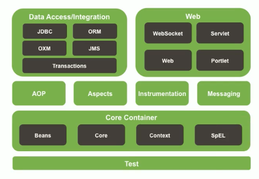

# MyJavaStudy
一、执行修改命令  
git remote set-url origin <url>  

二、先删除origin的指向，在add地址  
git remote rm origin  
git remote add origin <url>  

三、直接修改config文件  
.git>config>url=""  

并发：同一时刻，多个指令在单个cpu上交替进行  
并行：同一时刻，多个指令在多个cpu上同时进行  

ServletContext 应用域 整个应用之间共享数据   
ServletRequset 请求域 在当前请 求或请求转发之间共享数据  
HttpSession    会话域 在当前会话返回内数据共享  
PageContext    页面域 在当前页面使用  

基本数据类型  -*- bit(位)-byte(字节) 1byte = 1B = 8bit -*-  
byte    8位  
short   16位  
int     32位  
float   32位  
long    64位   
double  64位  
boolean true/false  
char    16位 单引号赋值 Unicode码  
引用数据类型 数组 类 接口  

MVC
model 封装数据  
view 视图   
controller 控制器 用于处理请求和响应  

Dao层传统实现方式  
控制层（controller）----->业务层（service）----->持久层（dao/mapper）---->DB  

MyBatis接口代理实现dao层  
1.映射配置文件中的名称空间必须和dao层接口的全类名相同  
  
2.映射配置文件中的增删改查标签的id属性必须和dao层接口的方法名相同  
3.映射配置文件中的增删改查标签的parametertype属性必须和dao层接口方法参数相同  
4.映射配置文件中的增删改查标签的resulttype属性必须的dao层接口返回值相同  
  

Radis 
单条数据操作 set key  value   
多条数据操作 mset key value  
设置数值数据增加指定范围的值  incr key / incrby key increment / incrbyfloat key increment
设置数值数据减少指定范围的值  decr key / decrby key  decr key    
设置数据生命周期 setex key seconds value / psetex key millseconds value   
表名：主键名：主键值：字段名 | 字段名对应数据   
           键值         | 数据值   

hash类型数据基本操作   
添加修改 hset key field value  
获取数据 hget key field / hgetall key  
删除数据 hdel key field1  
设置field的值 若存在则不做任何操作 hstnx key field value  
设置数值数据增加指定范围的值   hincrby key field increment / hincrbyfloat key increment   

list类型数据  
添加修改数据 lpush/rpush key value  
获取数据 lrange key start end / lindex key index / llen key  
获取并移除数据 lpop /rpop key  

set类型数据  
添加修改数据 sadd key value1 value2  
获取数据 smembers key  
删除指定 srem key  
获取集合数据总量 scard key  
判断集合中是否含有指定数据 sismember key member  
随机获取集合中指定数量的数据 srandmember key count  
获取某个数据并将该数据移除集合 spop key count  

key基本操作  
删除指定 del key  
获取key是否存在 exists key  
获取key类型  type key  
排序 sort  
改名 rename / renamenx key newkey  
为指定key设置有效期 expire key seconds / pexpire key milliseconds / expireat key timestamp / pexpireat key milliseconds-timestamp  
获取key有效时间 ttl / pttl key  
切换为永久性 persist key  

Spring是什么  （集成）
Spring是分层的JavaSE/EE应用full-stack轻量级开源框架   
最底层是核心容器，在核心容器上提供了aop等中间技术，再在这之上集成了其他的技术如dao层的jdbc、mybatis等，web层的servlet、websocket等  
  

