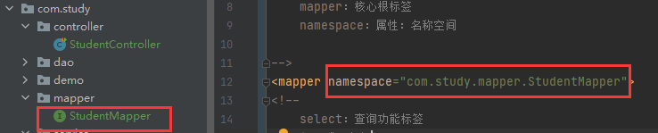
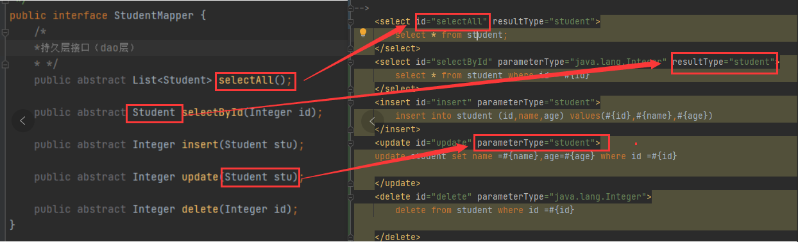

# MyJavaStudy
一、执行修改命令
git remote set-url origin <url>

二、先删除origin的指向，在add地址
git remote rm origin
git remote add origin <url>

三、直接修改config文件
.git>config>url=""

并发：同一时刻，多个指令在单个cpu上交替进行
并行：同一时刻，多个指令在多个cpu上同时进行

ServletContext 应用域 整个应用之间共享数据
ServletRequset 请求域 在当前请 求或请求转发之间共享数据
HttpSession    会话域 在当前会话返回内数据共享
PageContext    页面域 在当前页面使用

MVC
model 封装数据
view 视图 
controller 控制器 用于处理请求和响应

Dao层传统实现方式 
控制层（controller）----->业务层（service）----->持久层（dao/mapper）---->DB

MyBatis接口代理实现dao层
1.映射配置文件中的名称空间必须和dao层接口的全类名相同

2.映射配置文件中的增删改查标签的id属性必须和dao层接口的方法名相同
3.映射配置文件中的增删改查标签的parametertype属性必须和dao层接口方法参数相同
4.映射配置文件中的增删改查标签的resulttype属性必须的dao层接口返回值相同
